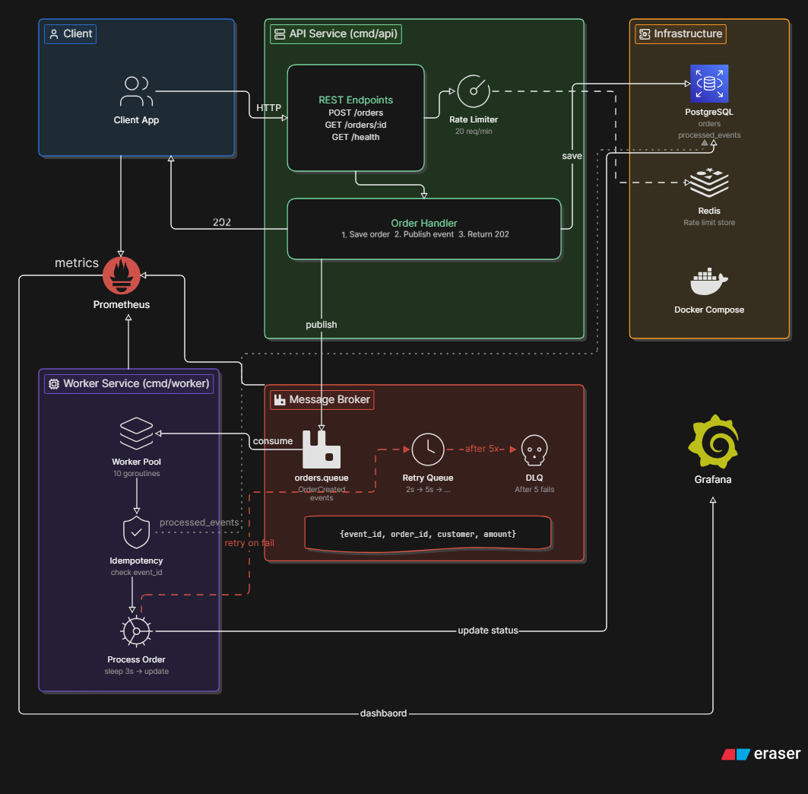
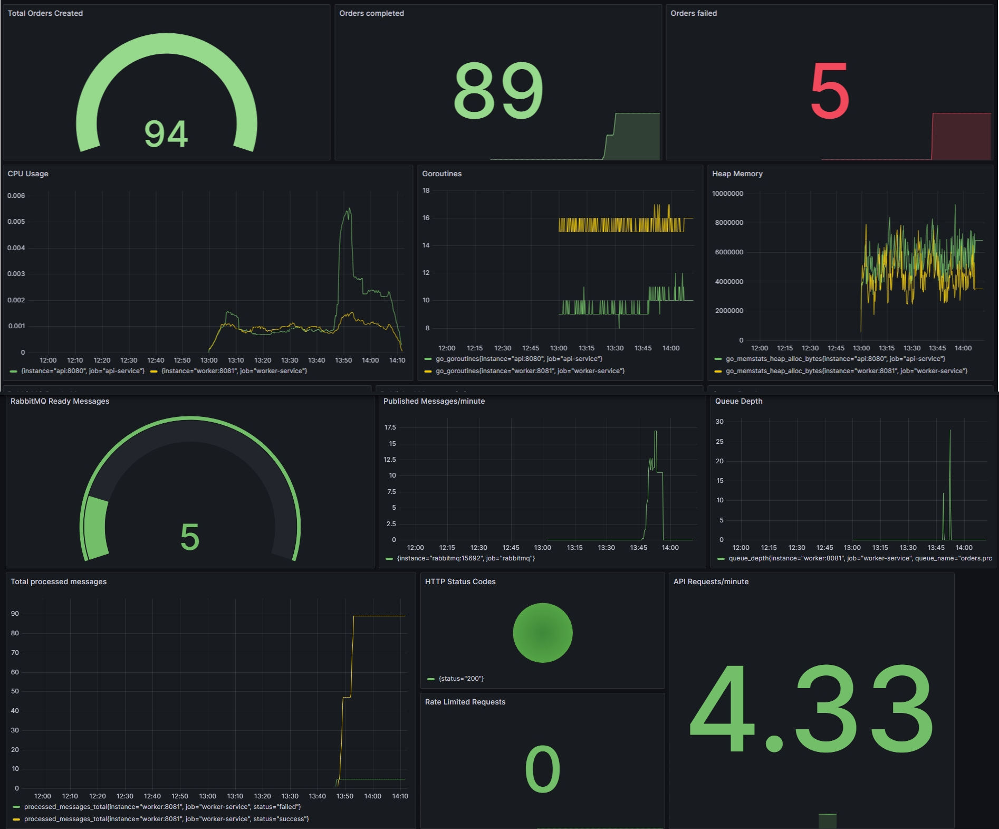

# Order Processing System

A asynchronous Order Processing simulation built with **Go** and the **Gin framework**. This project demonstrates how to handle high-concurrency order workflows asynchronously, robust worker pool throttling, dead-letter queueing (DLQ), idempotency checks, backpressure, and full Prometheus observability.

---

## 🚀 What This System Does

This system handles peak traffic by:
1. **Asynchronous Processing (`202 Accepted`)**: Queue requests with RabbitMQ and return 202 Accepted.
2. **Throttled Worker Consumption**: Bounded workers with RabbitMQ QoS for controlled concurrency.
3. **DLQ Strategy**: Automatic retries with exponential backoff and Dead Letter Queue support.
4. **Idempotency Safeguards**: Prevent duplicate event processing using unique database constraints.
5. **Observability Engine**: Prometheus metrics and Grafana dashboards for monitoring.

---

## Tech Stack

- Go
- Gin
- PostgreSQL
- RabbitMQ
- Redis
- Prometheus
- Grafana
- Docker & Docker Compose


## API Endpoints

| Method | Endpoint | Description |
|--------|----------|-------------|
| POST | `/orders` | Create a new order |
| GET | `/orders/:id` | Get order details |
| GET | `/health` | Health check |


---
## ⚙️ Getting Started

### Prerequisites
- Docker
- Git

### 1. Clone the Repository

```bash
git clone https://github.com/sunilsinghx/order-processing
cd order-processing-system
```

### 2. Create Environment File

Copy `.env.sample` as `.env` file in the project root.


### 3. Start Services

```bash
docker compose up -d
```
### 4. Initialize the Database

Copy the SQL file into the PostgreSQL container:

```bash
docker cp ./internal/db/db.sql order-postgres:/db.sql
```

Execute it:

```bash
docker exec -it order-postgres psql -U postgres -d orderdb -f /db.sql
```

## Architecture


## Observability


```
```
| Metric                    | PromQL                                                                                  | Visualization                |
| ------------------------- | --------------------------------------------------------------------------------------- | ---------------------------- |
| Total Orders Created      | `orders_created_total{instance="api:8080"}`                                             | **Gauge**                    |
| Orders completed          | `orders_completed_total{job="worker-service"}`                                          | **Stat**                     |
| Orders failed             | `orders_failed_total{instance="worker:8081"}`                                           | **Stat**                     |
| CPU Usage                 | `rate(process_cpu_seconds_total[5m])`                                                   | **Time series**              |
| Goroutines                | `go_goroutines`                                                                         | **Time series**              |
| Heap Memory               | `go_memstats_heap_alloc_bytes`                                                          | **Time series**              |
|  RabbitMQ Ready Messages  | `rabbitmq_queue_messages_ready`                                                         | **Gauge**                    |
| Published Messages/minute | `rate(rabbitmq_channel_messages_published_total[5m])*60`                                | **Time series**              |
| Queue Depth               | `queue_depth`                                                                           | **Time series**              |
| Total processed messages  | `processed_messages_total`                                                              | **Time series**              |
| HTTP Status Codes         | `sum by(status)(rate(http_requests_total[5m]))`                                         | **Gauge**                    |
| RabbitMQ Unacked Messages | `rabbitmq_queue_messages_unacked`                                                       | **Pie Chart**                |
| Rate Limited Requests     | `rate(rate_limit_total{instance="api:8080"}[5m])`                                       | **Stat**                     |
| API Requests/minute       | `sum(rate(http_requests_total[1m]))*60`                                                 | **Stat**                     |


